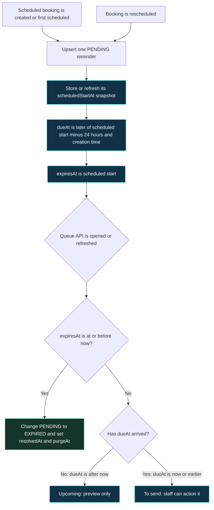
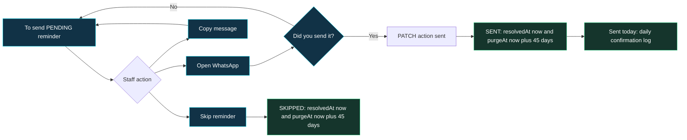
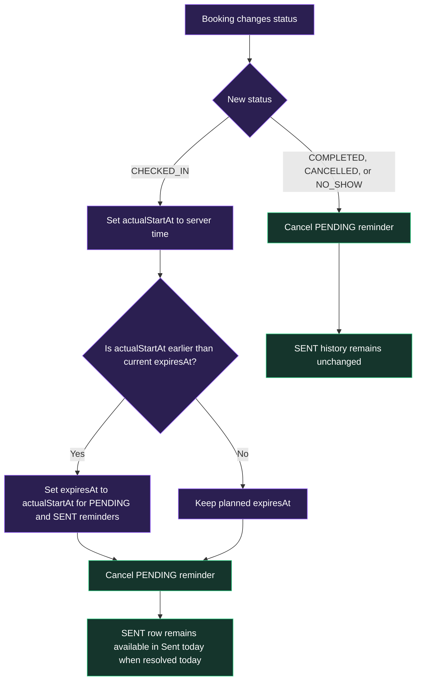
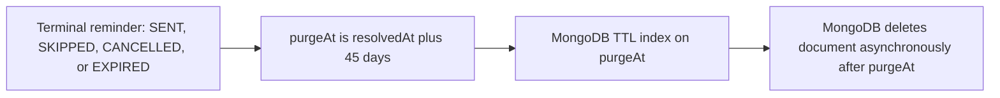

# Reminder flow chart

This is the operational map for Zenvork's manual appointment reminders. Read it top to bottom when
testing a booking or explaining why a reminder is visible in a particular tab.

## 1. Reminder creation and queue lifecycle



`dueAt` separates **Upcoming** from **To send**. `expiresAt` ends the actionable queue at the
appointment's effective start time. Both operational tabs contain only `PENDING` reminders where
`expiresAt > now`. On a reschedule, an existing pending reminder is refreshed in place. A sent or
skipped reminder is historical, so a reschedule creates a fresh pending reminder and retains the old
time snapshot for audit.

## 2. Staff actions from a To send row



Opening WhatsApp does **not** change the database. Only choosing **Yes** in Zenvork's confirmation
dialog records `SENT`. Zenvork does not yet know whether WhatsApp delivered the message.

`Sent today` is deliberately a separate daily log: it shows `SENT` reminders whose `resolvedAt` is
within the current business day. It does not use `expiresAt`, so staff can still see today's
confirmation after an appointment starts or is checked in early. At the next business-day boundary,
the row naturally leaves this tab but remains stored for retention/audit purposes.

## 3. Booking lifecycle can close the operational queue



This permits early check-in. The effective end of a pending reminder's operational visibility is:

```js
min(scheduledStartAt, actualStartAt ?? Infinity)
```

Example: a booking is planned for 11:00 AM but starts at 9:00 AM. Its pending reminder stops being
actionable at 9:00 AM. The original planned time remains on the booking for planning and reporting.

## 4. Status and visibility reference

| Reminder status | Can staff act? | Visibility | What caused it |
|---|---:|---|---|
| `PENDING` with `dueAt > now` | No | Upcoming while `expiresAt > now` | A scheduled booking is more than 24 hours away. |
| `PENDING` with `dueAt <= now` | Yes | To send while `expiresAt > now` | The reminder window has opened. |
| `SENT` | No | Sent today when `resolvedAt` falls in the current business day | Staff confirmed they sent the message. |
| `SKIPPED` | No | Not shown | Staff intentionally skipped it. |
| `CANCELLED` | No | Not shown | Booking checked in, cancelled, completed, or became no-show before sending. |
| `EXPIRED` | No | Not shown | Queue API found a pending reminder after its effective appointment start. |

## 5. Cleanup without a background job



There is no scheduler, queue worker, WhatsApp API, or cron job in the manual v1. Lazy expiry happens
when `GET /api/reminders` or a reminder action endpoint runs. MongoDB's TTL monitor later deletes old
terminal history.

## One complete example

```text
5 Oct, 11:00 PM: Booking created for 6 Oct, 11:00 AM
                   -> less than 24 hours away, so dueAt = now
                   -> shown in To send

5 Oct, 11:05 PM: Staff opens WhatsApp and confirms Yes
                   -> status = SENT and resolvedAt = 5 Oct, 11:05 PM
                   -> moves from To send to Sent today

6 Oct, 9:00 AM: Client arrives early and is checked in
                   -> actualStartAt = 9:00 AM; operational queue closes
                   -> no pending reminder can be actioned
                   -> the sent row was already a 5 Oct entry, so it is no longer in Sent today
                   -> SENT history remains until about 45 days later
```

## Reschedule after sending example

```text
6 Oct, 9:00 AM: Reminder for an 11:00 AM slot was already sent
                   -> this SENT record keeps scheduledStartAt = 11:00 AM

6 Oct, 9:30 AM: Booking is rescheduled to 4:00 PM
                   -> a new PENDING reminder is created for 4:00 PM
                   -> the old sent reminder is not overwritten

6 Oct, 10:00 AM: Staff sends the revised reminder
                   -> Sent today shows two rows: one for 11:00 AM and one for 4:00 PM
```
