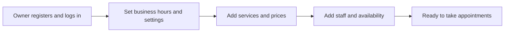
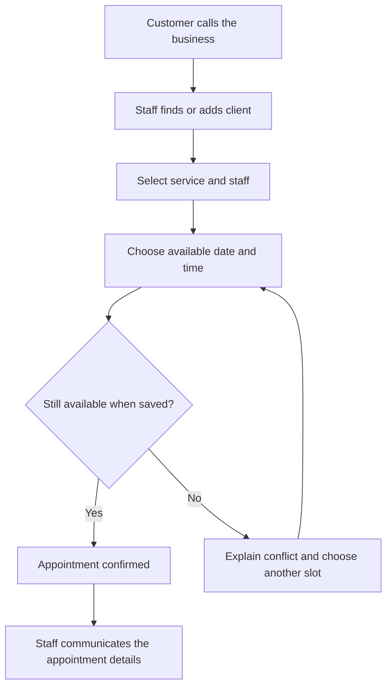
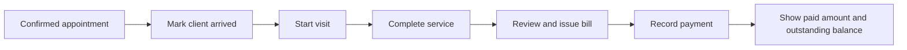
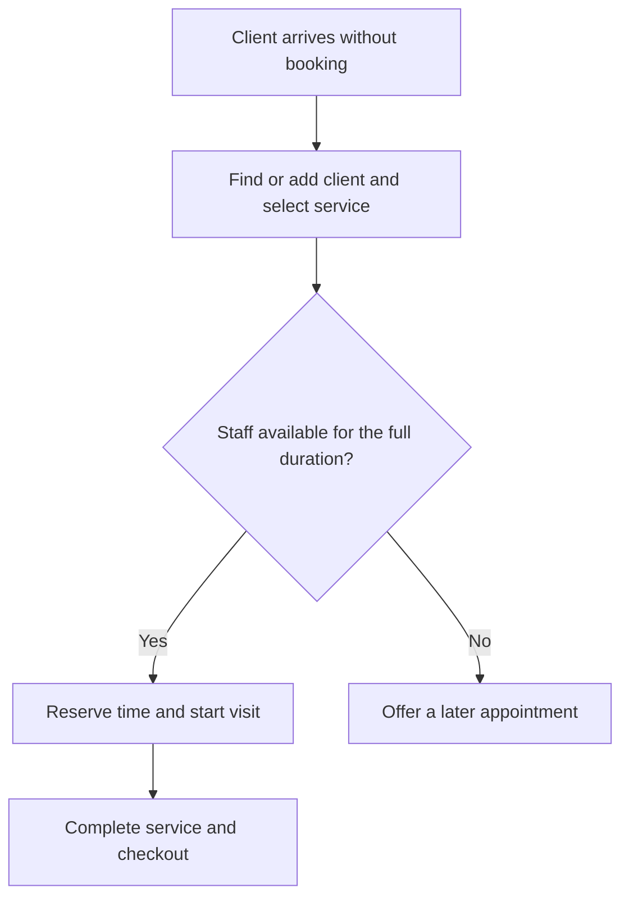

# Zenvork MVP requirements

- Status: Draft for review — scope and rules can change
- Updated: 2026-09-10
- MVP means the first useful release for a real business.

## 1. What we are building

Zenvork helps business owners and staff manage their daily operations in one application.
The proposed first release focuses on a salon: set up services and staff, record clients,
manage appointments and walk-ins, complete visits, and record bills and payments.

Clinics, gyms, and garages are future business types. Their workflows will be added when needed,
with shared behavior where it stays simple and dedicated features where their rules differ.
See [the provisional architecture direction](../decisions/003-simple-modular-business-architecture.md).

This document describes intended behavior, not features already implemented. Registration and
login groundwork exists; the operational workflows below are proposed work.

## 2. Who uses it

| Person | What they do |
|---|---|
| Owner | Sets up the business, manages staff access, and oversees daily operations and payments |
| Authorized staff | Manages clients, appointments, visits, and checkout within granted permissions |
| Client | Receives services; does not need a Zenvork account |

Each business owns its records. An owner or staff member must never access another business's
clients, appointments, bills, or other private data.

Proposed starting permission boundary: business settings and staff access are owner-only.
The exact staff permission list remains open; being a service provider does not automatically
grant access to all clients or financial information.

## 3. Proposed first-release scope

Start with one location per business and staff-managed bookings. A customer calls or visits,
and the owner or authorized staff enters the appointment. Saving a valid appointment confirms it.

Customer self-booking is still undecided. For planning this draft, it is deferred, not rejected.
If included in the first release, its availability, confirmation, cancellation, and abuse-prevention
rules need to be specified before implementation.

## 4. Functionality and descriptions

| Feature | What it lets the user do | Example |
|---|---|---|
| Business setup | Set business name, contact details, timezone, currency, and opening hours | Open Monday–Saturday, 10 AM–8 PM |
| Staff setup | Add service providers, working hours, breaks, and services they can perform; manage login access separately | Priya performs haircuts and works until 6 PM |
| Service catalogue | Create and deactivate services with a name, price, and duration | Haircut: 30 minutes at a configured price |
| Client records | Add or find a client by name/phone and view their visits | Find a returning client without entering their details again |
| Appointment booking | Select client, service, eligible staff, and an available time | Book a haircut with Priya tomorrow at 11 AM |
| Daily schedule | View appointments and filter by date or staff | Reception sees today's arrivals |
| Appointment changes | Reschedule, cancel, or mark a missed appointment | Move an appointment to the next available time |
| Walk-ins and visits | Record an immediate visit, arrival, service start, and completion | A customer arrives without a prior booking |
| Billing | Review performed services and create an itemized bill | A completed haircut becomes a bill |
| Payment recording | Record money received and its method; show the remaining balance | Record cash or a UPI payment received outside Zenvork |
| Daily overview | See today's appointments, visits awaiting checkout, and money recorded as received | Owner checks pending checkout at closing time |

Proposed simplifications: each appointment reserves one service and one staff member; additional
services can be recorded at checkout, but additional service time must pass availability checks
before it is used. Multi-service advance scheduling is deferred. Payment recording does not
mean Zenvork processes online payments or independently verifies a UPI transaction.

## 5. Main flows

### A. First-time business setup

The app should explain missing setup, such as no available staff, rather than showing an
unexplained empty booking screen.

### B. Customer calls to book

Confirmation means the business has accepted the booking. It does not mean a reminder was sent,
the customer acknowledged attendance, or payment was received.

### C. Appointment to checkout

Service completion and payment are separate. A completed visit may still have an unpaid bill.
The appointment tracks the reservation; the visit records the work performed.

### D. Walk-in

A walk-in should not require creating a future appointment. It must still respect existing
reservations. A dedicated waiting-list feature is outside this draft's first-release scope.

## 6. Proposed operating rules

| Area | Rule |
|---|---|
| Availability | A booking must fit business hours, staff hours, breaks, and existing reservations |
| Concurrent bookings | If two users try the same slot, only one conflicting reservation can succeed |
| Confirmation | Owner/staff bookings are confirmed on a successful save; no second approval step |
| Rescheduling | Validate the replacement slot before releasing the original reservation |
| Cancellation | Keep history and release the reserved time; do not silently delete the booking |
| No-show | Mark a missed appointment explicitly; it does not count as a completed service |
| Walk-in | Reserve the actual service time so another user cannot book the same staff concurrently |
| Changes to services | Price/duration changes apply to new bookings; preserve agreed values on existing records unless explicitly changed |
| Client lookup | Warn about likely duplicate contact details; do not assume a phone number uniquely identifies a person |
| Payment status | Derive unpaid, partially paid, or paid from the bill and recorded payments |
| Repeated submission | Double-clicking or retrying must not create duplicate appointments, bills, or payments |
| History | Record who made important booking and payment changes and when |
| Errors | Explain validation and API errors in language the owner/staff can act on |

Suggested appointment outcomes are confirmed, fulfilled, cancelled, and no-show. Visit progress
is arrived, in progress, and completed. Final state transitions, including interrupted visits,
must be agreed before implementing that workflow.

## 7. How we know the workflow works

- An owner can finish setup and create a booking without developer help.
- Authorized staff can find a returning client, choose an available service slot, and confirm it.
- Overlapping booking attempts cannot both reserve the same staff member.
- A rejected reschedule leaves the original appointment intact.
- A walk-in reserves time and appears in the day's operational view.
- Completing a visit makes it available for checkout without falsely marking it paid.
- Recording a partial payment displays the correct remaining balance; retrying does not duplicate it.
- Changing a catalogue price does not rewrite an existing bill.
- Unauthorized staff are denied restricted operations, including direct API requests.
- A user cannot read or modify another business's records, even using a known record ID.
- Forms and daily workflows remain usable on desktop and mobile screens.

These are acceptance criteria for implementation and verification, not claims that checks
currently pass.

## 8. Deferred features and future business flows

Deferred under this draft: customer self-booking, automated WhatsApp/SMS/email reminders,
online payment collection, memberships/packages, inventory, marketing, payroll/commissions,
multi-location operations, and a marketplace for discovering businesses.

| Future business | Illustrative flow | Specific features to evaluate |
|---|---|---|
| Clinic | Reception books patient → patient arrives → consultation → bill/payment → follow-up | Practitioner schedules; clinical encounters and prescriptions are a separate scope decision |
| Gym | Staff registers member → assigns membership → records payment → checks attendance | Membership validity, renewals, classes with capacity, personal training; ordinary gym visits need not be appointments |
| Garage | Staff records client and vehicle → schedules intake → opens repair job → obtains estimate approval → completes work → bills | Vehicles, inspections, parts, estimates, repair jobs |

These examples test our design assumptions. They are not a commitment to build every feature
or make all businesses use the salon's booking lifecycle.

## 9. Decisions still needed

| Decision | Draft assumption or next action |
|---|---|
| First business and location scope | Salon, one location per tenant; confirm with the first target users |
| Public booking timing | Deferred for this draft; explicitly decide before fixing release scope |
| Staff permissions | Define who sees all bookings, client history, and payments versus only assigned work |
| Service complexity | Validate whether one service/provider per appointment is sufficient for the first salon |
| Billing requirements | Establish launch market, taxes, numbering, rounding, discounts, corrections, and refunds before billing implementation |
| Client details | Decide required fields and how to handle clients without a phone number |
| Schedule exceptions | Define leave, late arrivals, overruns, and interrupted visits before scheduling implementation |
| Notifications | Decide whether staff communicating details manually is sufficient for initial users |

## 10. Suggested delivery order

1. Authenticated workspace, access boundaries, and business setup.
2. Services, staff availability, and client records.
3. Complete appointment creation, daily schedule, rescheduling, and cancellation.
4. Walk-ins, arrival, and service completion.
5. Billing, payment recording, and daily overview after billing rules are settled.
6. Validate with salon users and revise scope before expanding to another business type.

Implement and verify each complete workflow across frontend and backend. Update this draft as
decisions are made; avoid implementing unresolved rules by accident.
